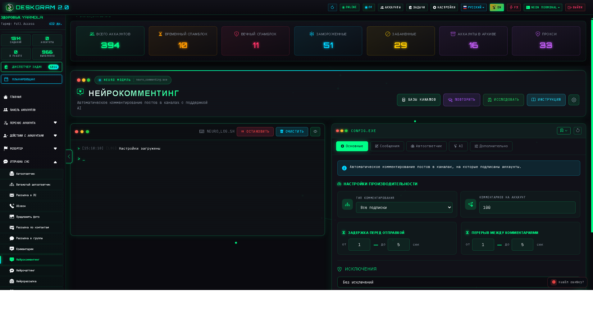
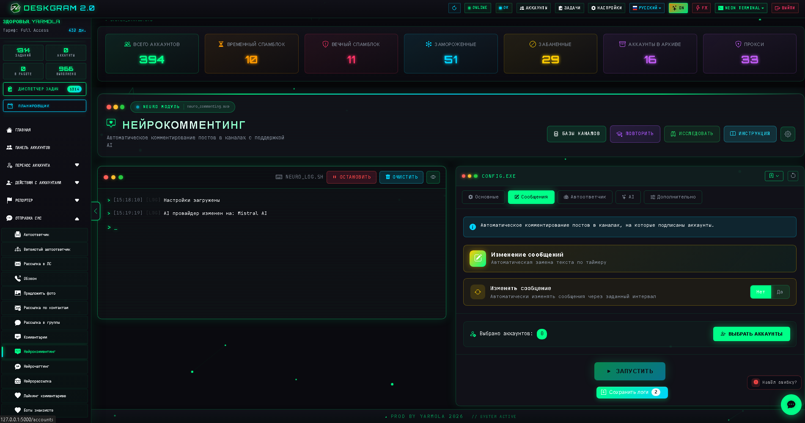
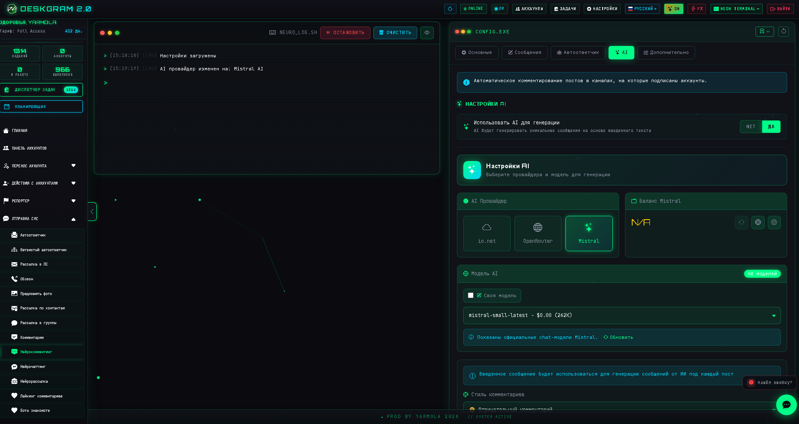
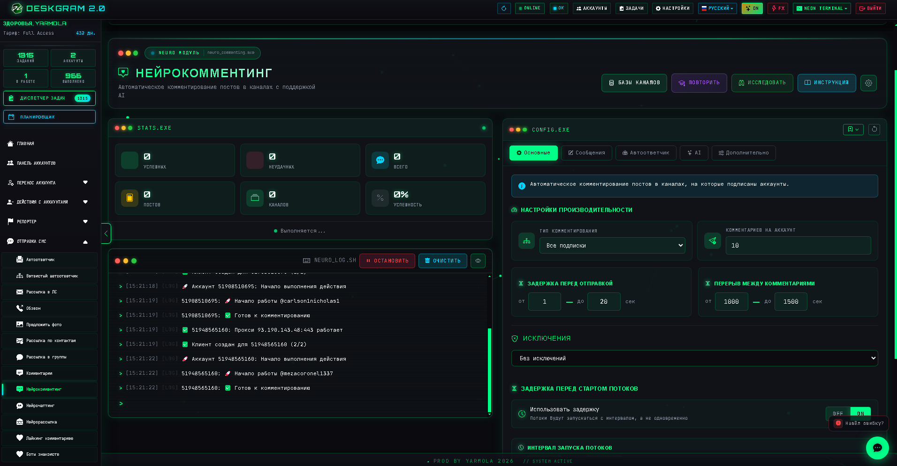

# Нейрокомментинг в Telegram с AI через Deskgram 2

`Нейрокомментинг` — это модуль Deskgram 2 для автоматического комментирования новых постов в Telegram-каналах. Он сочетает мониторинг публикаций, шаблонные и AI-комментарии, настройку лимитов, задержек, исключений и вспомогательные сценарии вроде автоответов.

[Главный хаб Deskgram 2](https://github.com/Deskgram-2/deskgram-2-telegram-automation) · [Сайт](https://deskgram2.com/) · [Telegram-бот](https://t.me/DG2welcomebot) · [Web preview](https://deskgram2.com/web-preview)
## Интерактивный Web Preview

Попробовать модуль в браузере: [Открыть веб-превью](https://deskgram2.com/web-preview?path=%2Fapp-demo%2Ffunctions%2Fneurocommenting)

Если хотите сначала понять, подходит ли вам этот сценарий, откройте веб-превью: так проще оценить интерфейс, сравнить модуль с соседними разделами и только потом переходить к установке и настройке.

## Кратко о модуле

| Параметр | Что внутри |
|---|---|
| Основная задача | Комментирование новых постов в Telegram-каналах |
| Источник текста | Шаблон, рерайт или AI по содержимому поста |
| Полезен для | Telegram-маркетинга, прогрева, работы с охватами |
| Важные настройки | Тип комментариев, лимиты, задержки, обсуждения, автоответчик |
| Связанные модули | Рассылка в ЛС, Сбор аудитории, Нейрорассылка |

## Что умеет модуль

- отслеживать новые посты в каналах;
- работать по всем подпискам или по отдельному списку каналов;
- писать комментарии по шаблону или генерировать их через AI;
- уникализировать текст перед отправкой;
- автоматически вступать в чаты обсуждений;
- подключать автоответчик на входящие ответы;
- вести статистику и логи по сессии.

## Быстрый старт

1. Выберите режим работы: все подписки или список каналов.
2. Настройте лимиты, задержки и исключения.
3. Выберите тип текста: шаблон, рерайт или AI по посту.
4. При необходимости включите автоответчик и работу с обсуждениями.
5. Назначьте аккаунты и запустите задачу.

## Что полезно подключить рядом

- [Панель аккаунтов](https://github.com/Deskgram-2/telegram-account-manager-deskgram), если сначала нужно подготовить рабочую сетку аккаунтов.
- [Настройки автоматизации](https://github.com/Deskgram-2/telegram-automation-settings-deskgram), если вы используете AI-провайдеров и системные параметры.
- [Рассылка в ЛС](https://github.com/Deskgram-2/telegram-direct-messaging-deskgram), если после комментариев нужен переход в личный диалог.
- [Сбор аудитории](https://github.com/Deskgram-2/telegram-audience-parser-deskgram), если параллельно нужен сценарий поиска и подготовки базы.

## Куда этот сценарий часто расширяют

- [Нейрочаттинг](https://github.com/Deskgram-2/telegram-neuro-chatting-deskgram), если AI-активность переносится из комментариев в живые чаты и группы;
- [Автоответчик](https://github.com/Deskgram-2/telegram-autoresponder-deskgram), если после комментариев важно не терять входящие ответы;
- [Нейрорассылка](https://github.com/Deskgram-2/telegram-neuro-mailing-deskgram), если дальше нужен управляемый AI-диалог в личке;
- [Массовые подписки](https://github.com/Deskgram-2/telegram-join-groups-deskgram), если перед комментингом или после него аккаунты готовятся через сообщества;
- [Диспетчер задач](https://github.com/Deskgram-2/telegram-task-manager-deskgram), если нужно централизованно контролировать всю цепочку активности.

## Интерфейс модуля

### Конструктор комментариев

Здесь задается базовый текст комментария, если вы работаете через шаблонный режим.

### AI-настройки

В этом блоке выбираются AI-провайдер, модель и режим генерации текста.

### Статистика и контроль

После запуска модуль показывает количество обработанных постов, успешные комментарии и ошибки.

## Когда особенно полезен

- когда нужно системно работать с комментариями под новыми постами;
- когда важен более живой текст вместо однообразных шаблонов;
- когда нужен контроль темпа и ограничений через лимиты и задержки;
- когда хочется объединить комментирование и дальнейший диалог через автоответчик.

## Почему это удобнее ручного подхода

| Ручной подход | Нейрокомментинг в Deskgram 2 |
|---|---|
| Нужно постоянно следить за новыми постами | Модуль сам отслеживает публикации |
| Комментарии быстро повторяются | Есть AI и рерайт текста |
| Сложно выдерживать темп и лимиты | Лимиты и задержки задаются в интерфейсе |
| Трудно масштабировать на несколько аккаунтов | Можно работать по сетке аккаунтов |
| Ответы после комментариев теряются | Можно включить автоответчик |

## Сценарии, в которых модуль особенно силен

### Сценарий 1. Прогрев через обсуждения под постами

Если задача не в прямой продаже с первого касания, а в мягком входе через обсуждения, нейрокомментинг работает как хороший верх воронки. Сначала аккаунты заходят в обсуждения, потом часть диалогов можно уводить в [рассылку в ЛС](https://github.com/Deskgram-2/telegram-direct-messaging-deskgram) или [автоответчик](https://github.com/Deskgram-2/telegram-autoresponder-deskgram).

### Сценарий 2. AI-слой поверх уже подготовленной среды

Если у вас уже есть аккаунты, прокси и базовая инфраструктура, этот модуль добавляет более живой текстовый слой. В такой схеме нейрокомментинг хорошо встает после [массовых подписок](https://github.com/Deskgram-2/telegram-join-groups-deskgram) и перед AI-коммуникацией в личке.

### Сценарий 3. Реакция на новые публикации в нишевых каналах

Когда важно быстро заходить под свежие посты в нужной нише, нейрокомментинг помогает не держать процесс вручную. Это особенно полезно в связке с discovery-репозиториями и [сбором из комментариев](https://github.com/Deskgram-2/telegram-comment-audience-parser-deskgram).

## Что выбрать: нейрокомментинг или обычное комментирование

| Если задача такая | Лучше использовать |
|---|---|
| Нужен более живой текст, привязанный к содержанию поста | [Нейрокомментинг](https://github.com/Deskgram-2/telegram-neuro-commenting-deskgram) |
| Нужен более прямой и шаблонный comments-flow по списку каналов | [Комментирование](https://github.com/Deskgram-2/telegram-comment-campaigns-deskgram) |
| Нужен первый engagement-слой с последующим диалогом | Нейрокомментинг + [автоответчик](https://github.com/Deskgram-2/telegram-autoresponder-deskgram) |
| Нужна comments-кампания как часть более широкой воронки | Оба сценария, в зависимости от глубины текста и роли AI |

## Что выбрать: нейрокомментинг или нейрочаттинг

| Если задача такая | Лучше использовать |
|---|---|
| Нужно реагировать именно на новые посты в каналах и обсуждениях | [Нейрокомментинг](https://github.com/Deskgram-2/telegram-neuro-commenting-deskgram) |
| Нужно вести AI-диалог в чатах, группах и живых обсуждениях | [Нейрочаттинг](https://github.com/Deskgram-2/telegram-neuro-chatting-deskgram) |
| Нужен верх воронки через комментарии с дальнейшим переносом в диалог | Сначала нейрокомментинг, потом нейрочаттинг |
| Нужен AI-слой для нескольких точек касания | Оба модуля в одной цепочке |

## FAQ для рабочих сценариев

### Что лучше выбрать для текста: шаблон, рерайт или AI?

Шаблон подходит для простых repeatable-сценариев. Рерайт полезен, когда нужна вариативность без полного отхода от исходного текста. AI-режим лучше работает там, где комментарий должен сильнее опираться на содержание поста и выглядеть более живым.

### Когда имеет смысл подключать автоответчик?

Когда комментарии используются не просто ради охвата, а как первый шаг к дальнейшему диалогу. В таком случае автоответчик помогает не терять ответы и переводить engagement в более глубокую коммуникацию.

### С какого окружения лучше запускать модуль?

Оптимально, когда уже подготовлены аккаунты, общие настройки и хотя бы базовая инфраструктура. Если комментарии идут в более интенсивном режиме, полезно заранее проверить [прокси](https://github.com/Deskgram-2/telegram-proxy-manager-deskgram) и рабочую сетку аккаунтов.

## Смежные репозитории

- [Главный хаб Deskgram 2](https://github.com/Deskgram-2/deskgram-2-telegram-automation)
- [Рассылка в ЛС](https://github.com/Deskgram-2/telegram-direct-messaging-deskgram)
- [Сбор аудитории](https://github.com/Deskgram-2/telegram-audience-parser-deskgram)
- [Панель аккаунтов](https://github.com/Deskgram-2/telegram-account-manager-deskgram)
- [Настройки автоматизации](https://github.com/Deskgram-2/telegram-automation-settings-deskgram)
- [Нейрочаттинг](https://github.com/Deskgram-2/telegram-neuro-chatting-deskgram)
- [Автоответчик](https://github.com/Deskgram-2/telegram-autoresponder-deskgram)
- [Нейрорассылка](https://github.com/Deskgram-2/telegram-neuro-mailing-deskgram)
- [Диспетчер задач](https://github.com/Deskgram-2/telegram-task-manager-deskgram)

## FAQ


### Можно ли посмотреть интерфейс до установки?

Да. В этом README уже есть прямая ссылка на веб-превью: можно открыть модуль в браузере, посмотреть структуру раздела и понять, подходит ли он под вашу задачу еще до установки и настройки аккаунтов.

### Нужен ли AI для работы модуля?

Нет. Можно использовать шаблонный текст. AI нужен для большей вариативности и привязки к содержимому поста.

### Можно ли комментировать только выбранные каналы?

Да. Для этого используется режим работы по заранее заданному списку каналов.

### Что делать, если комментарии требуют чат обсуждения?

Включить автоматическое вступление в обсуждения, если это подходит вашему сценарию.

### Как снижать риск ограничений?

Работать с умеренными лимитами, паузами и не перегружать новые аккаунты.

## Полезные ссылки

- [Главный хаб Deskgram 2](https://github.com/Deskgram-2/deskgram-2-telegram-automation)
- [Сайт Deskgram 2](https://deskgram2.com/)
- [Telegram-бот Deskgram 2](https://t.me/DG2welcomebot)
- [Web preview](https://deskgram2.com/web-preview)
